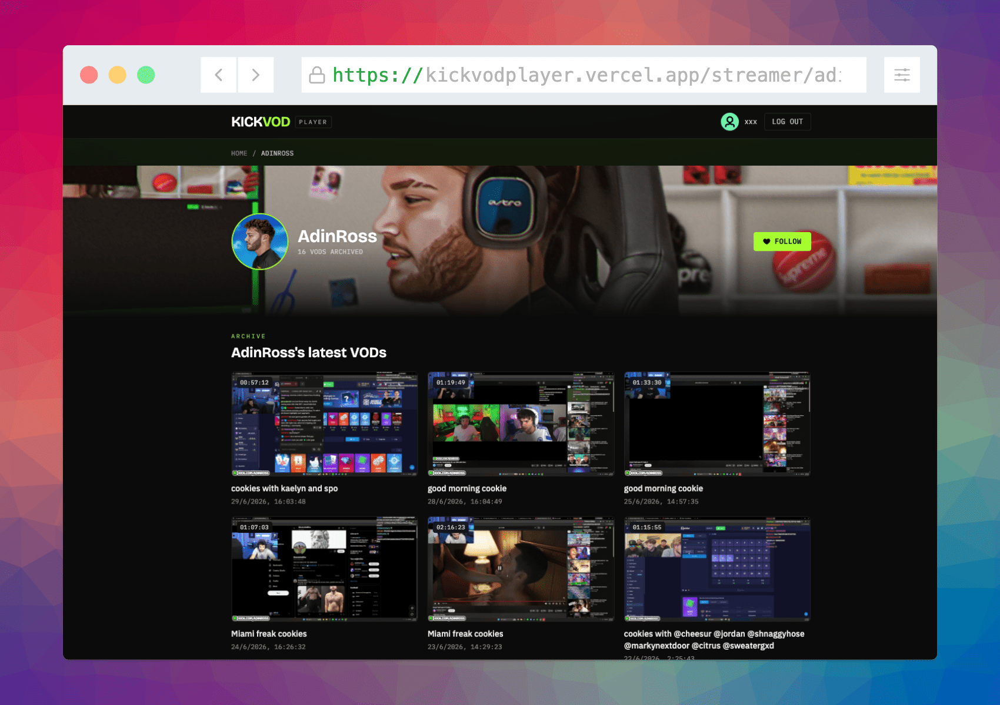

<h1>📽️ Kick VODs Player</h1>
<h2>This project is created for educational purposes only. Kick is the owner of all videos and content. This project is non-profit and is not responsible for the use that may be made of it.</h2>

## 🚀 Project Description

I'm a big Twitch user, and recently, a lot of my favorite streamers have
switched to Kick.

I mostly watch VODs a few days after they're broadcast, and Kick has
been disappointing in this area. There are playback issues, it doesn't
save your progress in the video, and you can't use gestures on mobile to
skip forward or backward, among other things.

So, I made this app to make watching VODs on Kick more comfortable. It
lets you watch Kick VODs easily. If you log in to the app (via Twitch,
using the button in the top right), you can save your progress in videos
and pick up where you left off later, even on a different device.

Kick might block access to its content at some point, so I can't
guarantee this app will work forever.

## 💾 Technologies Used

The data is obtained using Kick's "public" API.

The website is developed with the [Astro](https://astro.build/) framework
(v7) and we use the [Tailwind CSS](https://tailwindcss.com/) framework (v4)
to style the user interface. As the video player, we use
[Video.js v10](https://github.com/videojs/v10) (`@videojs/react`, currently
in beta) — its built-in skin covers quality selection, playback speed,
hotkeys/gestures, and mobile touch controls out of the box, so no separate
plugins are needed anymore. See [`vendor/README.md`](vendor/README.md) for
why a from-source build is vendored instead of installed from npm.

Auth and the database are handled by [Supabase](https://supabase.com/):
Supabase Auth (Twitch OAuth provider) for login, and Postgres with row-level
security for follows and watch-progress data. Both used to run on
[Astro DB](https://astro.build/db/) (now deprecated) and
[auth-astro](https://github.com/nowaythatworked/auth-astro) (unmaintained).

The website is deployed using [Vercel](https://vercel.com/)'s service.

All contributions are welcome.

## 🔑 Environment variables

Copy `.env.default` to `.env.local` and fill in:

| Variable                   | Purpose                                         |
| :-------------------------- | :----------------------------------------------- |
| `SUPABASE_URL`              | Your Supabase project URL                        |
| `SUPABASE_ANON_KEY`         | Supabase anon/publishable key (server-side use)  |
| `PUBLIC_SUPABASE_URL`       | Same URL, exposed to the browser client          |
| `PUBLIC_SUPABASE_ANON_KEY`  | Same key, exposed to the browser client          |

Twitch OAuth credentials are configured directly in the Supabase dashboard
(Authentication → Providers → Twitch), not as env vars in this project.

## 🧞 Commands

All commands are run from the root of the project, from a terminal:

| Command                   | Action                                           |
| :------------------------ | :----------------------------------------------- |
| `npm install`             | Installs dependencies                            |
| `npm run dev`             | Starts local dev server at `localhost:4321`      |
| `npm run build`           | Build your production site to `./dist/`          |
